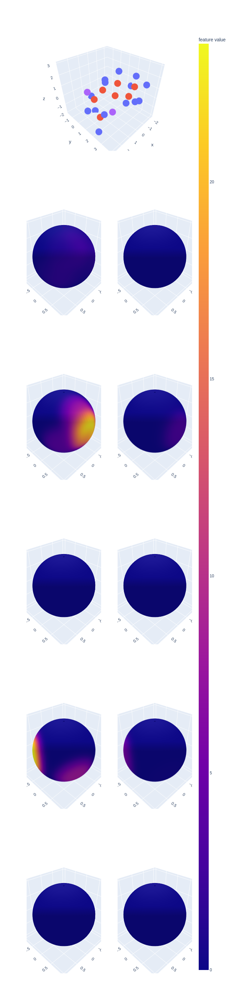

# Using Neural Tangent Kernels as predictors on the QM9 dataset

This repository is just a small example demonstrating how the infinite-width, infinite-training-time solution resulting from Neural Tangent Kernel (NTK) theory can be used to predict properties of the QM9 dataset. It demonstrates the basic setup used in one of our experiments in [*arXiv:2406.06504*](https://arxiv.org/abs/2406.06504) but without our equivariant layers. This will be published later. The actual computation of the NTK is implemented in the [neural_tangents](https://github.com/google/neural-tangents) library.

## Installation

Installing the module with pip:
```bash
$ cd gntk
$ pip install .
```

## Usage

To fit a kernel solution corresponding to a 2 layer MLP on 128 training samples and evaluate the performance on 128 test samples, run:
```bash
python kernel_prediction.py --model mlp --n_layers 2 --n_train 128 --n_test 128
```

The input signals consist of 29 spherical signals (corresponding to the at most 29 atoms in QM9 molecules) which contain 10 features each. An example of the features corresponding to a single atom can be plotted with
```bash
python plot_input_feature_example.py
```
The construction of the spherical signals is described in [*arxiv:2306.05420*](https://arxiv.org/abs/2306.05420)



